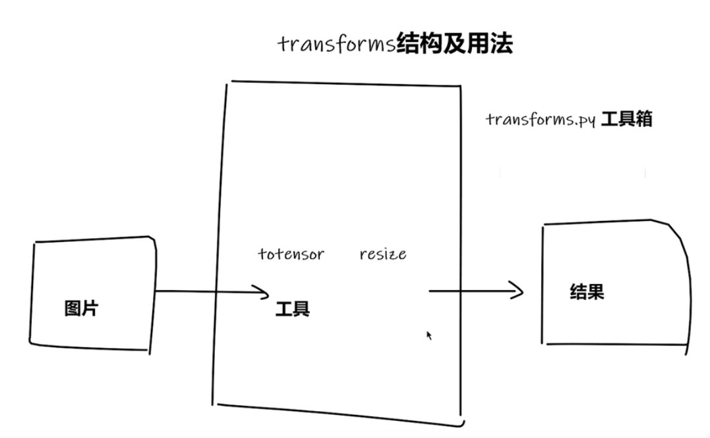
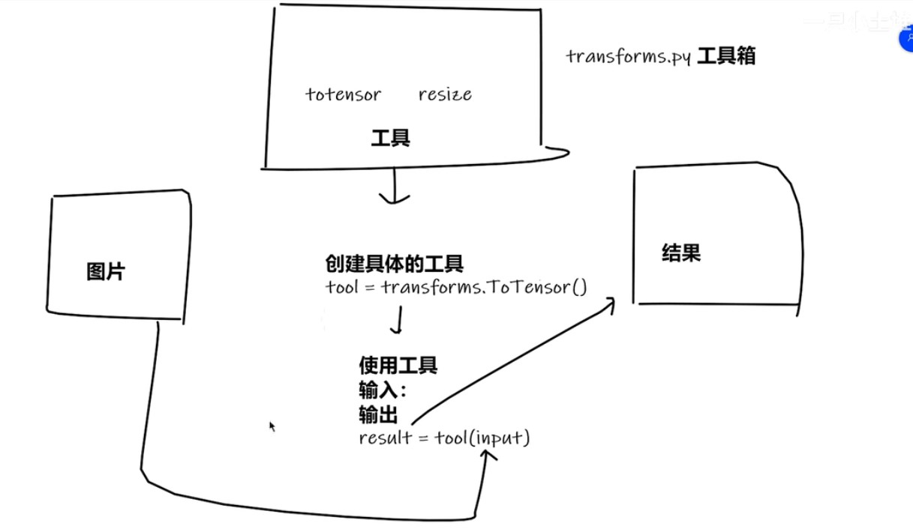
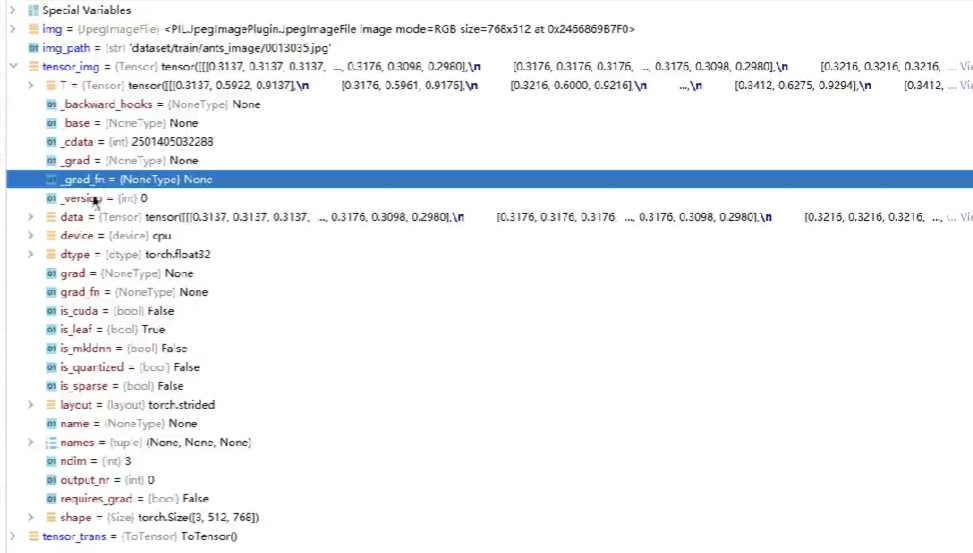

### 介绍



transforms是pytorch的一个工具箱，里面封装一些工具，旋转、缩放、正则化等一系列操作。

### 具体使用

```python
from PIL import Image
from torchvision import transforms

image_path = "..\..\data\\train\\ants\\0013035.jpg"  # 相对路径
img_PIL = Image.open(image_path) # PIL格式

# 转为tensor
tensor_trans = transforms.ToTensor()
tensor_img = tensor_trans(img_PIL)

print(tensor_img)

```



### 为什么用Tensor



这里发现Tensor和numpy差别还是很大的，在Tensor中保存了梯度、前向传播等很多神经网络需要用的参数。

### 后续一点操作

```python
from PIL import Image
from torchvision import transforms
from torch.utils.tensorboard import SummaryWriter

image_path = "..\..\data\\train\\ants\\0013035.jpg"  # 相对路径
img_PIL = Image.open(image_path) # PIL格式

writer = SummaryWriter("logs")


# 转为tensor
tensor_trans = transforms.ToTensor()
tensor_img = tensor_trans(img_PIL)

writer.add_image("tensor_img",tensor_img)

writer.close()

# print(tensor_img)
```

这里单纯把numpy类型换成了tensor类型