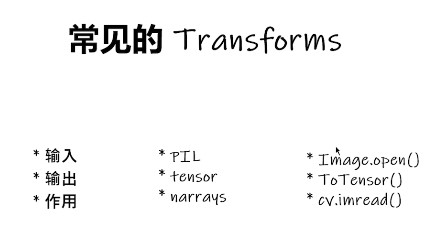
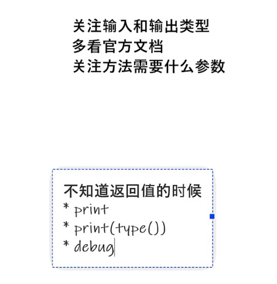

### 介绍



这里up主介绍了一些transforms方法的使用：

自己记住流程  看官方文档，关注输入输出，用的时候再查。



代码的话单纯是功能实际使用，还是自己熟悉流程比较好。

```python

writer = SummaryWriter("logs")
img = Image.open("..\..\data\\train\\ants\\0013035.jpg")
print(img)

#  ToTensor
trans_totensor = transforms.ToTensor()
img_tensor = trans_totensor(img)
writer.add_image("ToTensor", img_tensor,1)

#  Normalize

print(img_tensor[0][0][0])  # 处理前，看看第一个位置的数值
trans_norm = transforms.Normalize([0.5, 0.5, 0.5], [0.5, 0.5, 0.5])  # 因为图像时三个channel的，所以，均值和方差都是三维的
img_norm = trans_norm(img_tensor)
print(img_norm[0][0][0])  # 处理后，再看第一个位置的数值，看一下前后变化
writer.add_image("Normalize", img_norm, 2)

#  Resize  输入是 PIL 类型才行

print(img.size)
trans_resize = transforms.Resize((128, 128)) # 宽和高，写一个会等比例缩放
img_resize = trans_resize(img)
img_resize = trans_totensor(img_resize)
writer.add_image("Resize", img_resize, 3)
print(img_resize) # 看一下变换后的维度

#  Compose -resize -2  把多个transforms合起来，前一个的输出是后一个的输入

trans_resize_2 = transforms.Resize(128)
trans_compose = transforms.Compose([trans_resize_2, trans_totensor])
img_resize_2 = trans_compose(img)
writer.add_image("Resize", img_resize_2, 4)

#  RandomCrop  随机裁剪

trans_random = transforms.RandomCrop(200, 200)
trans_compose_2 = transforms.Compose([trans_random, trans_totensor])
for i in range(10):
    img_crop = trans_compose_2(img)
    writer.add_image("RandomCrop", img_crop, i)

writer.close()
```

