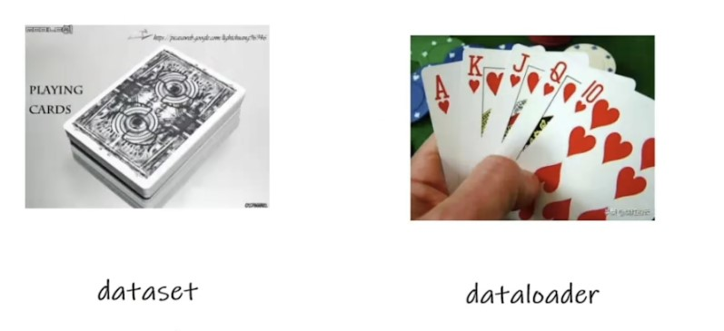
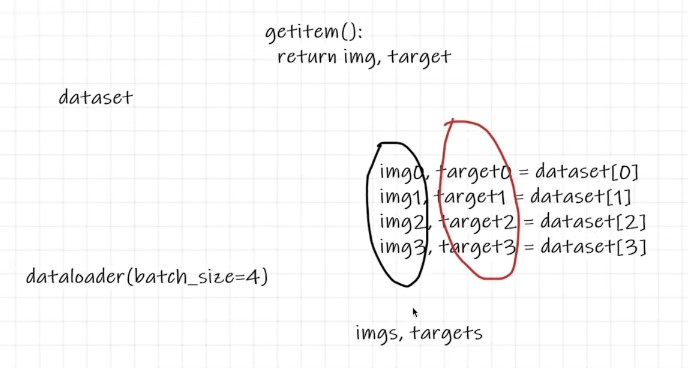
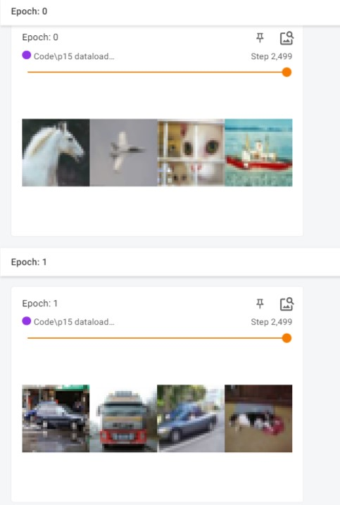

#### 介绍



up在这里类别了打牌，dataloader就是从牌堆中抓取扑克牌。

```python
# 导包
import torchvision
from torch.utils.data import DataLoader
from torch.utils.tensorboard import SummaryWriter

test_data = torchvision.datasets.CIFAR10("./dataset", train=False, transform=torchvision.transforms.ToTensor(),download=True) # 加载数据集

test_loader = DataLoader(dataset=test_data, batch_size=64, shuffle=True, num_workers=0, drop_last=True)
```

参数说明:

​		batch_size 每次打包多少个数据

​		shuffle 是否打乱顺序

​		num_workers 线程数，windows>0可能出问题

​		drop_last	如果最后一组数量<batch_size是否舍弃



图片辅助理解batch_size。

```python
# 测试数据集中第一张图片及target
img, target = test_data[0]
# print(img.shape)  
# print(target) 

# 这里打包batch_size个img和target 进入两个列表
for data in test_loader:  # 这个loader，返回的内容，就已经是包含了 img 和 target 两个值了，这个在 cifar 数据集的 getitem 函数里，写了
    imgs, targets = data
    print(imgs.shape)
    print(targets)
```

打印输出下imgs和targets，是两个列表。

```python
writer = SummaryWriter("dataloader")
for epoch in range(2):  # 两轮,验证shuffle每次打乱是随机打乱(可以设置随机种子，每次打乱顺序一样)
    step = 0
    for data in test_loader:  
        imgs, targets = data
        writer.add_images("Epoch: {}".format(epoch), imgs, step)
        step = step + 1

writer.close()
```

存下tensorboard，看下两次打乱是否不一样。



发现两次是不一样的。

关于数据预处理的部分到此结束。