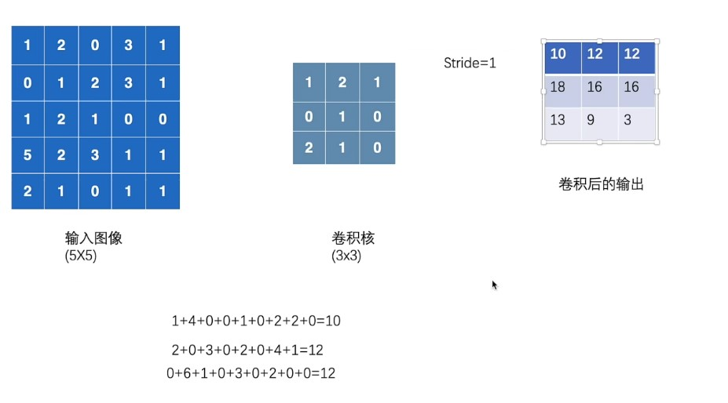
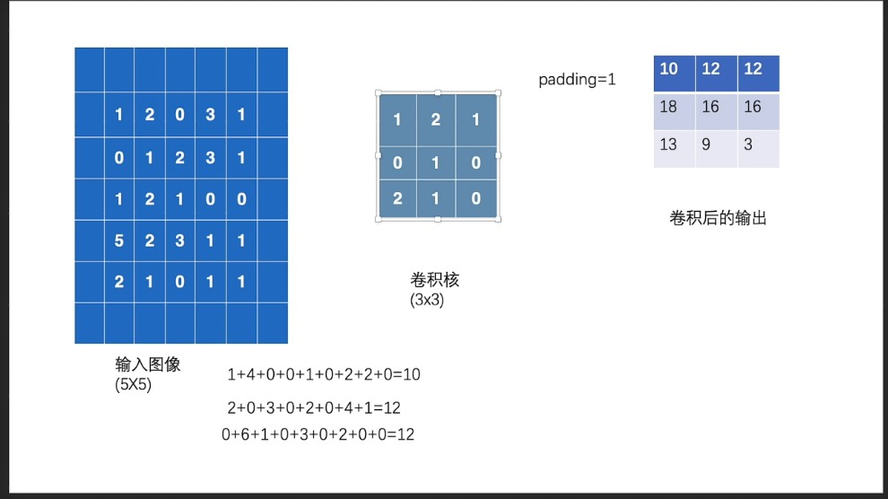

### 介绍

import torch.nn.functional as F 

这里function是nn的子包，但是很常用，一般单独导入。

然后介绍卷积操作：

​		卷积操作目的是减少图片维度(减少了参数数量),保留关键信息。



具体操作是卷积核对位相乘作为结果，算完之后往后往下走。

这里不想多记。

然后代码：

```python
import torch
import torch.nn.functional as F  # 制作一个函数的句柄，后面方便直接使用了

input = torch.tensor([[1, 2, 0, 3, 1],
                      [0, 1, 2, 3, 1],
                      [1, 2, 1, 0, 0],
                      [5, 2, 3, 1, 1],
                      [2, 1, 0, 1, 1]])

kernel = torch.tensor([[1, 2, 1],
                       [0, 1, 0],
                       [2, 1, 0]])
print("input:", input)
print("kernel:", kernel)

print("input.shape:", input.shape)
print("kernel.shape:", kernel.shape)


#  要想用 torch.nn.functional.conv2d 这个函数，就必须满足形状的要求，上述的尺寸不满足，要做处理
#  上述的尺寸，只有input.shape: torch.Size([5, 5])， kernel.shape: torch.Size([3, 3])，并没有4个通道


input = torch.reshape(input, (1, 1, 5, 5))  # 注意这4个数字的意义，分别是：batch_size, in_channel, H, W , 变换形状之后，重新赋值给 input
kernel = torch.reshape(kernel, (1, 1, 3, 3))  # 注意这4个数字的意义，跟上面的不一样了

print("input.shape:", input.shape)
print("kernel.shape:", kernel.shape)

output = F.conv2d(input, kernel, stride=1)
print(output)

output2 = F.conv2d(input, kernel, stride=2)
print(output2)

output3 = F.conv2d(input, kernel, stride=1, padding=1)  # padding 设置的值，是往外扩充的行列数，值都是0，至于想要修改这个值，还有另外一个参数，一般不改
print(output3)

output4 = F.conv2d(input, kernel, stride=1, padding=0)  # padding 默认值是 0
print(output4)
```

注意的几个点：

​	1.注意卷积要求的输入维度，参数要四个batch_size(批量大小)，in_channel(输入通道数)，高和宽

​	2.参数说明:

​			stride  步长，即每次卷积运算完成走几个格子。

​			padding  填充，上下左右都填充，填充1即3x3变5x5

​			图片辅助理解：

