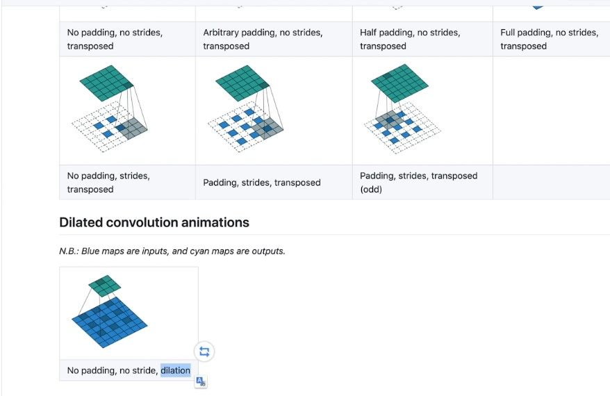
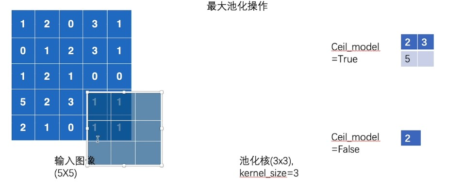

#### 介绍



如果说卷积层把相邻的信息整合起来，提取了图片的特征。

那么池化层就是把这些特征整合起来，来降低特征和位置的关联程度。

一般二者交替出现。

```python
import torch
from torch import nn
from torch.nn import MaxPool2d

import torchvision
from torch.utils.data import DataLoader
from torch.utils.tensorboard import SummaryWriter
```

参数说明：

​	kernel_size	卷积核大小

​	ceil_mode	对于不满卷积核大小的，如何操作



如上，举例说明了True和False的区别。

```python
dataset = torchvision.datasets.CIFAR10(root="../data", train=False, transform=torchvision.transforms.ToTensor(),
                                       download=True)

dataloader = DataLoader(dataset, batch_size=64)

input = torch.tensor([[1, 2, 0, 3, 2],
                      [3, 2, 4, 5, 6],
                      [3, 4, 5, 6, 2],
                      [1, 3, 2, 6, 5],
                      [5, 6, 2, 1, 3]], dtype=torch.float32) #必须指定，不然默认整型会报错

input_reshape = torch.reshape(input, (-1, 1, 5, 5))

print(input_reshape)
print(input_reshape.shape)

class Tudui(nn.Module):
    def __init__(self):
        super().__init__()
        self.maxpool1 = MaxPool2d(kernel_size=3, ceil_mode=True)

    def forward(self, input):
        output = self.maxpool1(input)
        return output


tudui = Tudui()


writer = SummaryWriter("maxpool_log")
step = 0


for data in dataloader:
    imgs, targets = data
    output = tudui(imgs)
    writer.add_images("input", imgs, step)
    writer.add_images("maxpool", output, step)
    step += 1

writer.close()


```

