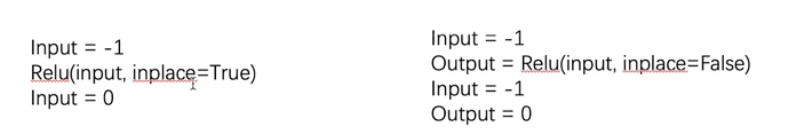

### 介绍

这里实际上用Relu来举例激活函数。

激活函数把线性变成非线性，具有更多非线性特征，更容易拟合。

Relu就两个参数(input,inplace)

inplace是说是否覆盖input(默认False)



```python
import torch
import torchvision
from torch import nn
from torch.nn import ReLU, Sigmoid
from torch.utils.data import DataLoader
from torch.utils.tensorboard import SummaryWriter

'''
非线性激活层，只有一个batch_size一个参数需要设置
'''

input = torch.tensor([[1, -0.5],
                      [-1, 3]])

input = torch.reshape(input, (-1, 1, 2, 2))
print(input.shape)

dataset = torchvision.datasets.CIFAR10("../dataset", train=False, download=True,
                                       transform=torchvision.transforms.ToTensor())

dataloader = DataLoader(dataset, batch_size=64)


class Tudui(nn.Module):
    def __init__(self):
        super(Tudui, self).__init__()
        self.relu1 = ReLU()
        self.sigmoid1 = Sigmoid()

    def forward(self, input):
        output = self.sigmoid1(input)
        return output


tudui = Tudui()

writer = SummaryWriter("logs_relu")
step = 0
for data in dataloader:
    imgs, targets = data
    writer.add_images("input", imgs, step)
    output = tudui(imgs)
    writer.add_images("output", output, step)
    step += 1

writer.close()

'''
实现的效果就是：
torch.Size([1, 1, 2, 2])
tensor([[1., 0.],
        [0., 3.]])
'''

'''
非线性变换的目的：
给网络中，引入非线性的特征，非线性特征多的话，才能训练出符合各种曲线或特征的模型
否则，泛化能力不好
'''


```

代码没什么值得关注的。