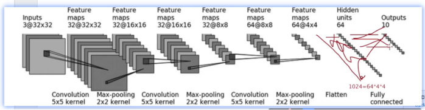

### 介绍

这里介绍了sequential

不过实现的时候重点在算下参数吧。



代码看下notebook就OK了。

```python
import torch
from torch import nn
from torch.nn import Conv2d, MaxPool2d, Linear
from torch.nn.modules.flatten import Flatten
from torch.nn.modules import Sequential
# from torch.utils.tensorboard import SummaryWriter


class Tudui(nn.Module):
    def __init__(self):
        super(Tudui, self).__init__()
        self.conv1 = Conv2d(3, 32, 5, padding=2)  
        self.maxpool1 = MaxPool2d(2)   
        self.conv2 = Conv2d(32, 32, 5, padding=2)
        self.maxpool2 = MaxPool2d(2)
        self.conv3 = Conv2d(32, 64, 5, padding=2)
        self.maxpool3 = MaxPool2d(2)
        self.flatten = Flatten()  # 展平操作
        self.linear1 = Linear(64 * 4 * 4, 64)
        self.linear2 = Linear(64, 10)
        self.model1 = Sequential(
            Conv2d(3, 32, 5, padding=2)  ,
            MaxPool2d(2)   ,
            Conv2d(32, 32, 5, padding=2),
            MaxPool2d(2),
            Conv2d(32, 64, 5, padding=2),
            MaxPool2d(2),
            Flatten(),  # 展平操作
            Linear(64 * 4 * 4, 64),
            Linear(64, 10))

    def forward(self, m):
        # m = self.conv1(m)
        # m = self.maxpool1(m)
        # m = self.conv2(m)
        # m = self.maxpool2(m)
        # m = self.conv3(m)
        # m = self.maxpool3(m)
        # m = self.flatten(m)
        # m = self.linear1(m)
        # m = self.linear2(m)
        m = self.model1(m)
        return m


tudui = Tudui()
print("tudui:", tudui)
input = torch.ones((64, 3, 32, 32))
output = tudui(input)
print("output.shape:", output.shape)


```

