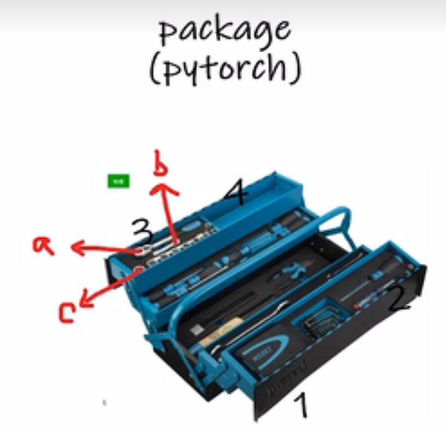

### 介绍



这里把pytorch看出一个**工具箱**，每个工具箱里面有小的**工具包**，一直到最小的直接使用的**工具**。

dir()  打开与查看

help() 教你使用

例如：

​		dir(pytorch)->输出1，2，3，4

​		dir(pytorch.3)->输出a,b,c

而help则是具体使用

例如：

​		help(pytorch.3.a)->输出：螺丝刀的使用方法。

vscode自己实操：

```python
import torch
print("查看torch的工具包\n",dir(torch))
print("查看torch.cuda的工具包\n",dir(torch.cuda))
print("查看torch.cuda.is_available的工具包\n",dir(torch.cuda.is_available))
print("查看is_available方法的使用\n",help(torch.cuda.is_available))
```

结果如下：

查看torch的工具包
 ['AVG', 'AggregationType', 'AliasDb', 'Any', 'AnyType', 'Argument', 'ArgumentSpec', 'AwaitType', 'BFloat16Storage', 'BFloat16Tensor', 'BenchmarkConfig', '_preload_cuda_deps', '_prelu_kernel', '_prims', '_prims_common', '_propagate_xla_data', '_refs', '_register_device_module', '_remove_batch_dim', '_reshape_alias_copy', '_reshape_from_tensor', '_resize_output_', '_rowwise_prune', '_running_with_deploy', '_sample_dirichlet', '_saturate_weight_to_fp16', '_scaled_dot_product_attention_math', '_scaled_dot_product_efficient_attention', '_scaled_dot_product_flash_attention', '_scaled_mm', '_segment_reduce', '_shape_as_tensor', '_sobol_engine_draw', '_sobol_engine_ff_', '_sobol_engine_initialize_state_', '_sobol_engine_scramble_', '_softmax', '_softmax_backward_data', '_sources', '_sparse_broadcast_to', '_sparse_broadcast_to_copy', '_sparse_coo_tensor_unsafe', '_sparse_csr_prod', '_sparse_csr_sum', '_sparse_log_softmax_backward_data', '_sparse_semi_structured_linear', '_sparse_softmax_backward_data', '_sparse_sparse_matmul', '_sparse_sum', '_stack', '_standard_gamma', '_standard_gamma_grad', '_storage_classes', '_subclasses', '_sync', '_tensor', '_tensor_classes', '_tensor_str', '_test_autograd_multiple_dispatch', '_test_autograd_multiple_dispatch_view', '_test_autograd_multiple_dispatch_view_copy', '_test_check_tensor', '_test_functorch_fallback', '_test_serialization_subcmul', '_to_cpu', '_to_functional_tensor', '_to_sparse_semi_structured', '_transform_bias_rescale_qkv', '_transformer_encoder_layer_fwd', '_trilinear', '_triton_multi_head_attention', '_triton_scaled_dot_attention', '_unique', '_unique2', '_unpack_dual', '_unsafe_index', '_unsafe_index_put', '_use_cudnn_ctc_loss', '_use_cudnn_rnn_flatten_weight', '_utils', '_utils_internal', '_validate_compressed_sparse_indices', '_validate_sparse_bsc_tensor_args', '_validate_sparse_bsr_tensor_args', '_validate_sparse_compressed_tensor_args', '_validate_sparse_coo_tensor_args', '_validate_sparse_csc_tensor_args', '_validate_sparse_csr_tensor_args', '_values_copy', '_vmap_internals', '_warn_typed_storage_removal', '_weight_norm', '_weight_norm_interface', '_weights_only_unpickler', 'abs', 'abs_', 'absolute', 'acos', 'acos_', 'acosh', 'acosh_', 'adaptive_avg_pool1d', 'adaptive_max_pool1d', 'add', 'addbmm', 'addcdiv', 'addcmul', 'addmm', 'addmv', 'addmv_', 'addr', 'adjoint', 'affine_grid_generator', 'alias_copy', 'align_tensors', 'all', 'allclose', 'alpha_dropout', 'alpha_dropout_', 'amax', 'amin', 'aminmax', 'amp', 'angle', 'any', 'ao', 'arange', 'arccos', 'arccos_', 'arccosh', 'arccosh_', 'arcsin', 'arcsin_', 'arcsinh', 'arcsinh_', 'arctan', 'arctan2', 'arctan_', 'arctanh', 'arctanh_', 'are_deterministic_algorithms_enabled', 'argmax', 'argmin', 'argsort', 'argwhere', 'as_strided', 'as_strided_', 'as_strided_copy', 'as_strided_scatter', 'as_tensor', 'asarray', 'asin', 'asin_', 'asinh', 'asinh_', 'atan', 'atan2', 'atan_', 'atanh', 'atanh_', 'atleast_1d', 'atleast_2d', 'atleast_3d', 'attr', 'autocast', 'autocast_decrement_nesting', 'autocast_increment_nesting', 'autograd', 'avg_pool1d', 'backends', 'baddbmm', 'bartlett_window', 'base_py_dll_path', 'batch_norm', 'batch_norm_backward_elemt', 'batch_norm_backward_reduce', 'batch_norm_elemt', 'batch_norm_gather_stats', 'batch_norm_gather_stats_with_counts', 'batch_norm_stats', 'batch_norm_update_stats', 'bernoulli', 'bfloat16', 'bilinear', 'binary_cross_entropy_with_logits', 'bincount', 'binomial', 'bits16', 'bits1x8', 'bits2x4', 'bits4x2', 'bits8', 'bitwise_and', 'bitwise_left_shift', 'bitwise_not', 'bitwise_or', 'bitwise_right_shift', 'bitwise_xor', 'blackman_window', 'block_diag', 'bmm', 'bool', 'broadcast_shapes', 'broadcast_tensors', 'broadcast_to', 'bucketize', 'builtins', 'can_cast', 'candidate', 'cartesian_prod', 'cat', 'ccol_indices_copy', 'cdist', 'cdouble', 'ceil', 'ceil_', 'celu', 'celu_', 'cfloat', 'chain_matmul', 'chalf', 'channel_shuffle', 'channels_last', 'channels_last_3d', 'cholesky', 'cholesky_inverse', 'cholesky_solve', 'choose_qparams_optimized', 'chunk', 'clamp', 'clamp_', 'clamp_max', 'clamp_max_', 'clamp_min', 'clamp_min_', 'classes', 'classproperty', 'clear_autocast_cache', 'clip', 'clip_', 'clone', 'col_indices_copy', 'column_stack', 'combinations', 'compile', 'compiled_with_cxx11_abi', 'compiler', 'complex', 'complex128', 'complex32', 'complex64', 'concat', 'concatenate', 'conj', 'conj_physical', 'conj_physical_', 'constant_pad_nd', 'contiguous_format', 'conv1d', 'conv2d', 'conv3d', 'conv_tbc', 'conv_transpose1d', 'conv_transpose2d', 'conv_transpose3d', 'convolution', 'copysign', 'corrcoef', 'cos', 'cos_', 'cosh', 'cosh_', 'cosine_embedding_loss', 'cosine_similarity', 'count_nonzero', 'cov', 'cpp', 'cpu', 'cross', 'crow_indices_copy', 'ctc_loss', 'ctypes', 'cuda', 'cuda_path', 'cuda_version', 'cudnn_affine_grid_generator', 'cudnn_batch_norm', 'cudnn_convolution', 'cudnn_convolution_add_relu', 'cudnn_convolution_relu', 'cudnn_convolution_transpose', 'cudnn_grid_sampler', 'cudnn_is_acceptable', 'cummax', 'cummin', 'cumprod', 'cumsum', 'cumulative_trapezoid', 'default_generator', 'deg2rad', 'deg2rad_', 'dequantize', 'det', 'detach', 'detach_', 'detach_copy', 'device', 'diag', 'diag_embed', 'diagflat', 'diagonal', 'diagonal_copy', 'diagonal_scatter', 'diff', 'digamma', 'dist', 'distributed', 'distributions', 'div', 'divide', 'dll', 'dll_path', 'dll_paths', 'dlls', 'dot', 'double', 'dropout', 'dropout_', 'dsmm', 'dsplit', 'dstack', 'dtype', 'e', 'eig', 'einsum', 'embedding', 'embedding_bag', 'embedding_renorm_', 'empty', 'empty_like', 'empty_permuted', 'empty_quantized', 'empty_strided', 'enable_grad', 'eq', 'equal', 'erf', 'erf_', 'erfc', 'erfc_', 'erfinv', 'exp', 'exp2', 'exp2_', 'exp_', 'expand_copy', 'expm1', 'expm1_', 'export', 'eye', 'fake_quantize_per_channel_affine', 'fake_quantize_per_tensor_affine', 'fbgemm_linear_fp16_weight', 'fbgemm_linear_fp16_weight_fp32_activation', 'fbgemm_linear_int8_weight', 'fbgemm_linear_int8_weight_fp32_activation', 'fbgemm_linear_quantize_weight', 'fbgemm_pack_gemm_matrix_fp16', 'fbgemm_pack_quantized_matrix', 'feature_alpha_dropout', 'feature_alpha_dropout_', 'feature_dropout', 'feature_dropout_', 'fft', 'fill', 'fill_', 'finfo', 'fix', 'fix_', 'flatten', 'flip', 'fliplr', 'flipud', 'float', 'float16', 'float32', 'float64', 'float8_e4m3fn', 'float8_e5m2', 'float_power', 'floor', 'floor_', 'floor_divide', 'fmax', 'fmin', 'fmod', 'fork', 'frac', 'frac_', 'frexp', 'frobenius_norm', 'from_dlpack', 'from_file', 'from_numpy', 'frombuffer', 'full', 'full_like', 'func', 'functional', 'fused_moving_avg_obs_fake_quant', 'futures', 'fx', 'gather', 'gcd', 'gcd_', 'ge', 'geqrf', 'ger', 'get_autocast_cpu_dtype', 'get_autocast_gpu_dtype', 'get_autocast_ipu_dtype', 'get_autocast_xla_dtype', 'get_default_dtype', 'get_deterministic_debug_mode', 'get_device', 'get_file_path', 'get_float32_matmul_precision', 'get_num_interop_threads', 'get_num_threads', 'get_rng_state', 'glob', 'gradient', 'greater', 'greater_equal', 'grid_sampler', 'grid_sampler_2d', 'grid_sampler_3d', 'group_norm', 'gru', 'gru_cell', 'gt', 'half', 'hamming_window', 'hann_window', 'hardshrink', 'has_lapack', 'has_mkl', 'has_openmp', 'has_spectral', 'heaviside', 'hinge_embedding_loss', 'histc', 'histogram', 'histogramdd', 'hsmm', 'hsplit', 'hspmm', 'hstack', 'hub', 'hypot', 'i0', 'i0_', 'igamma', 'igammac', 'iinfo', 'imag', 'import_ir_module', 'import_ir_module_from_buffer', 'index_add', 'index_copy', 'index_fill', 'index_put', 'index_put_', 'index_reduce', 'index_select', 'indices_copy', 'inf', 'inference_mode', 'init_num_threads', 'initial_seed', 'inner', 'inspect', 'instance_norm', 'int', 'int16', 'int32', 'int64', 'int8', 'int_repr', 'inverse', 'is_anomaly_check_nan_enabled', 'is_anomaly_enabled', 'is_autocast_cache_enabled', 'is_autocast_cpu_enabled', 'is_autocast_enabled', 'is_autocast_ipu_enabled', 'is_autocast_xla_enabled', 'is_complex', 'is_conj', 'is_deterministic_algorithms_warn_only_enabled', 'is_distributed', 'is_floating_point', 'is_grad_enabled', 'is_inference', 'is_inference_mode_enabled', 'is_loaded', 'is_neg', 'is_nonzero', 'is_same_size', 'is_signed', 'is_storage', 'is_tensor', 'is_vulkan_available', 'is_warn_always_enabled', 'isclose', 'isfinite', 'isin', 'isinf', 'isnan', 'isneginf', 'isposinf', 'isreal', 'istft', 'jit', 'kaiser_window', 'kernel32', 'kl_div', 'kron', 'kthvalue', 'last_error', 'layer_norm', 'layout', 'lcm', 'lcm_', 'ldexp', 'ldexp_', 'le', 'legacy_contiguous_format', 'lerp', 'less', 'less_equal', 'lgamma', 'library', 'linalg', 'linspace', 'load', 'lobpcg', 'log', 'log10', 'log10_', 'log1p', 'log1p_', 'log2', 'log2_', 'log_', 'log_softmax', 'logaddexp', 'logaddexp2', 'logcumsumexp', 'logdet', 'logical_and', 'logical_not', 'logical_or', 'logical_xor', 'logit', 'logit_', 'logspace', 'logsumexp', 'long', 'lstm', 'lstm_cell', 'lstsq', 'lt', 'lu', 'lu_solve', 'lu_unpack', 'manual_seed', 'margin_ranking_loss', 'masked', 
'masked_fill', 'masked_scatter', 'masked_select', 'math', 'matmul', 'matrix_exp', 'matrix_power', 'matrix_rank', 'max', 'max_pool1d', 'max_pool1d_with_indices', 'max_pool2d', 'max_pool3d', 'maximum', 'mean', 'median', 'memory_format', 'merge_type_from_type_comment', 'meshgrid', 'min', 'minimum', 'miopen_batch_norm', 'miopen_convolution', 'miopen_convolution_add_relu', 'miopen_convolution_relu', 'miopen_convolution_transpose', 'miopen_depthwise_convolution', 'miopen_rnn', 'mkldnn_adaptive_avg_pool2d', 'mkldnn_convolution', 'mkldnn_linear_backward_weights', 'mkldnn_max_pool2d', 'mkldnn_max_pool3d', 'mkldnn_rnn_layer', 'mm', 'mode', 'moveaxis', 'movedim', 'mps', 'msort', 'mul', 'multinomial', 'multiply', 'multiprocessing', 'mv', 'mvlgamma', 'name', 'nan', 'nan_to_num', 'nan_to_num_', 'zeros_like']
查看torch.cuda的工具包
 ['Any', 'BFloat16Storage', 'BFloat16Tensor', 'BoolStorage', ......,  'warnings']
查看torch.cuda.is_available的工具包
 ['__annotations__', '__call__', '__class__', '__closure__', '__code__', '__defaults__', '__delattr__', '__dict__', '__dir__', '__doc__', '__eq__', '__format__', '__ge__', '__get__', '__getattribute__', '__globals__', '__gt__', '__hash__', '__init__', '__init_subclass__', '__kwdefaults__', '__le__', '__lt__', '__module__', '__name__', '__ne__', '__new__', '__qualname__', '__reduce__', '__reduce_ex__', '__repr__', '__setattr__', '__sizeof__', '__str__', '__subclasshook__']
Help on function is_available in module torch.cuda:

is_available() -> bool
    Returns a bool indicating if CUDA is currently available.

查看is_available方法的使用
 None

