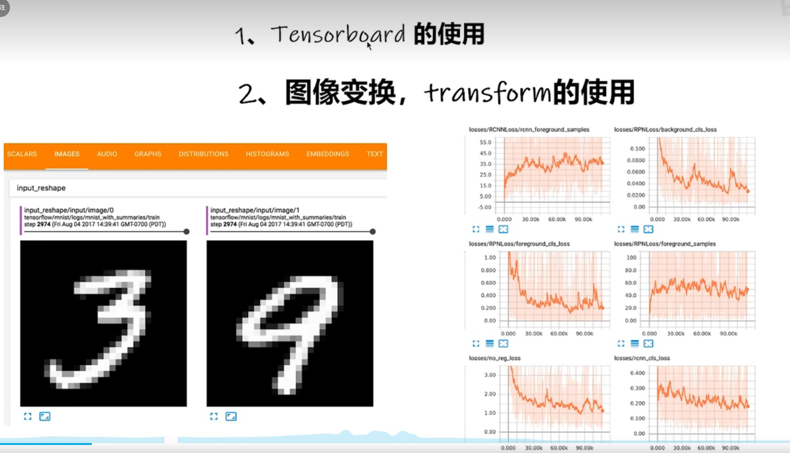
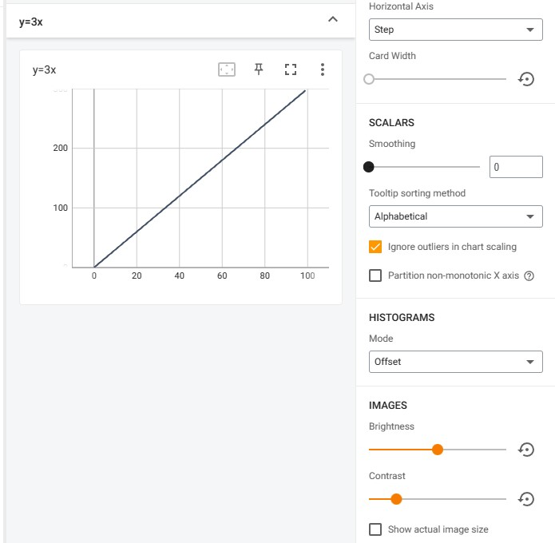
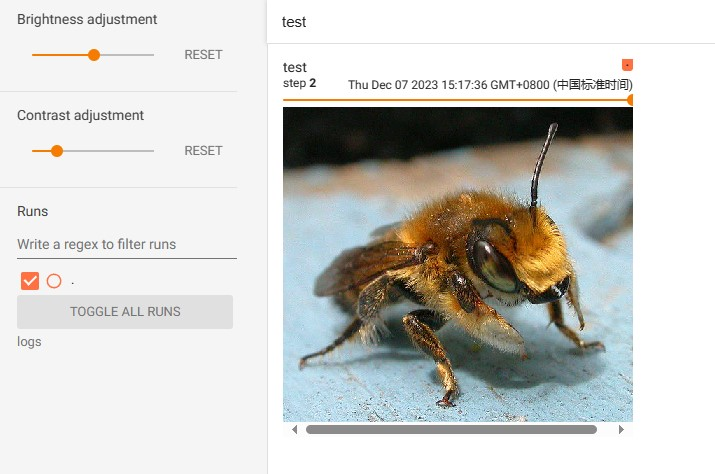

### 介绍



TensorBoard可以让我们查看具体某一步骤的情况，如上。

### 代码

```python
from torch.utils.tensorboard import SummaryWriter
# 一个类，往事件文件夹里写东西

writer = SummaryWriter("logs")

for i in range(100):
  writer.add_scalar("y=x",i,i)

writer.close()

```

这里的add_scalar是往里面添加一个标量的方法。

### 具体使用

在终端中输入：tensorboard --logdir=logs --port=6007

--logdir指定文件夹  port指定端口(减少和别人的冲突)

TensorBoard 2.10.0 at http://localhost:6007/ (Press CTRL+C to quit)

访问这个地址：



如图，具体后续操作可以自己试一下。

代码中：

```python
for i in range(100):
  writer.add_scalar("y=3x",3*i,i)
```

前面标签不改的话，会把多个文件放在一个图里，会很乱，所以记得改标签/换个文件夹存放事件。

### add_image相关操作

```python
from torch.utils.tensorboard import SummaryWriter
# 一个类，往事件文件夹里写东西

import numpy as np
from PIL import Image

writer = SummaryWriter("logs")
image_path = "data\\train\\bees\\16838648_415acd9e3f.jpg"  # 相对路径
img_PIL = Image.open(image_path) # PIL格式
img_array = np.array(img_PIL) # 转为numpy格式
print(img_array.shape)

writer.add_image("test",img_array,2,dataformats='HWC')

# for i in range(100):
#   writer.add_scalar("y=x",i,i)

writer.close()

```


这里add_image要注意的是图片的格式，这里图片格式是(height,width,channel)，要在参数中指出。

然后第三个参数是step,即第n步，我们可以拖动查看第n步的图片(即神经网络的输入)。

如图：
